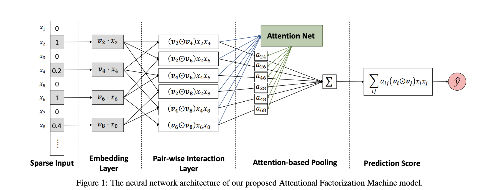
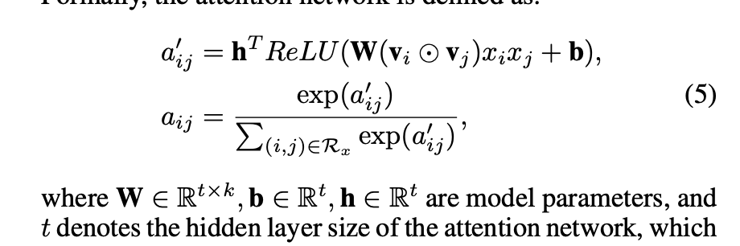
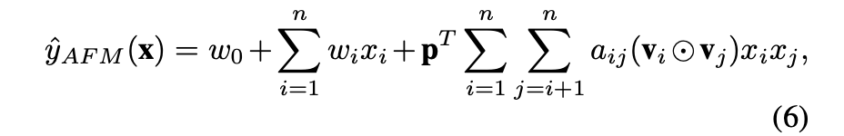
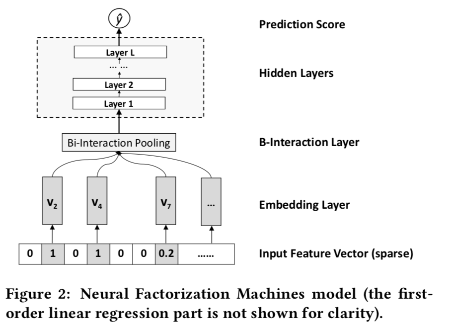

# Attentional Factorization Machines: Learning the Weight of Feature Interactions via Attention Networks

## 链接

## 对该文章的印象：
- 这文章就是 NFM(BIP层) 加一个简单的attention 机制，这都水上论文了；
- 模型结构：
- attention 层： 
- 最终公式：

