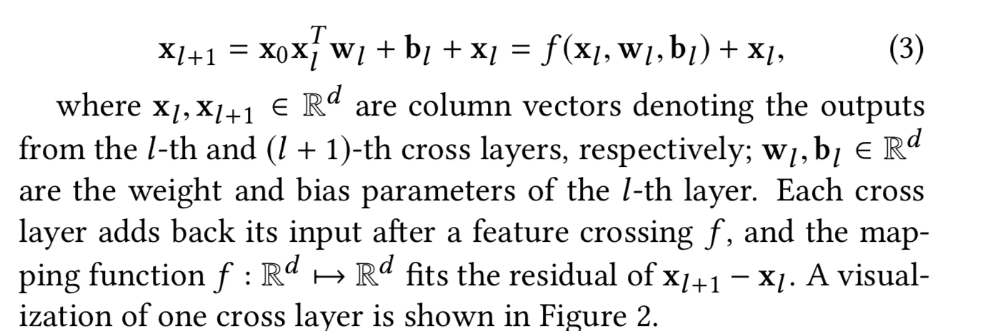

# Deep & Cross Network for Ad Click Predictions

Deep & Cross Network for Ad Click Predictions
## 链接

## 对该文章的印象：
- 每层用到残差结构 
- cross layer 
	- 两个注意：
		- 1. 没有bs 维度间的交互；你先不要 bs,F 这样去看（这样看会变成bs 维度间的交互），先单个样本去看，发现没有bs 间交互，实际上是 X_0 = [F，bs]
		- 2. 无论求第几层，x0 永远不变，不会随着层的变化而变化；
- model structure 
