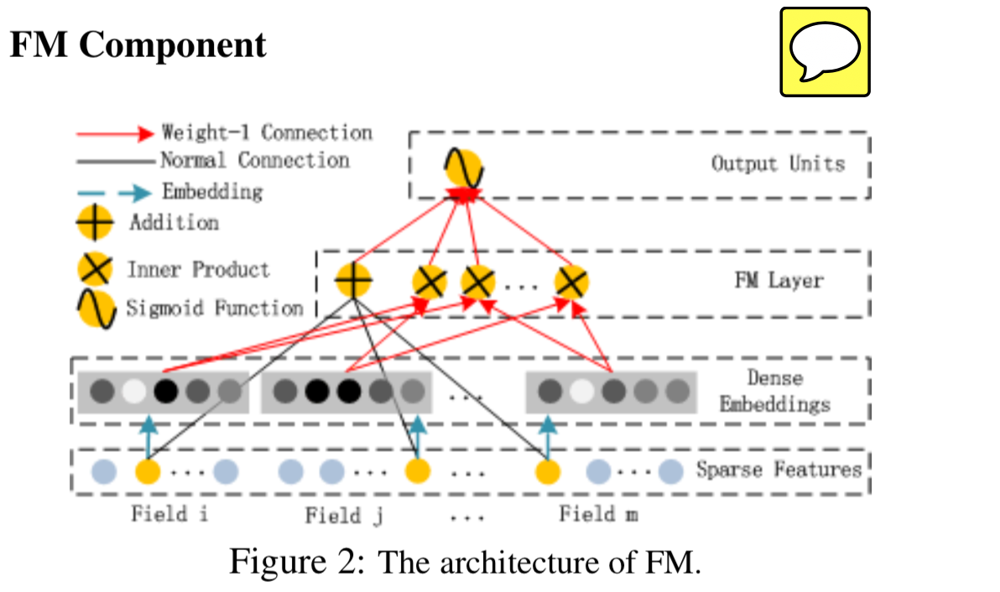
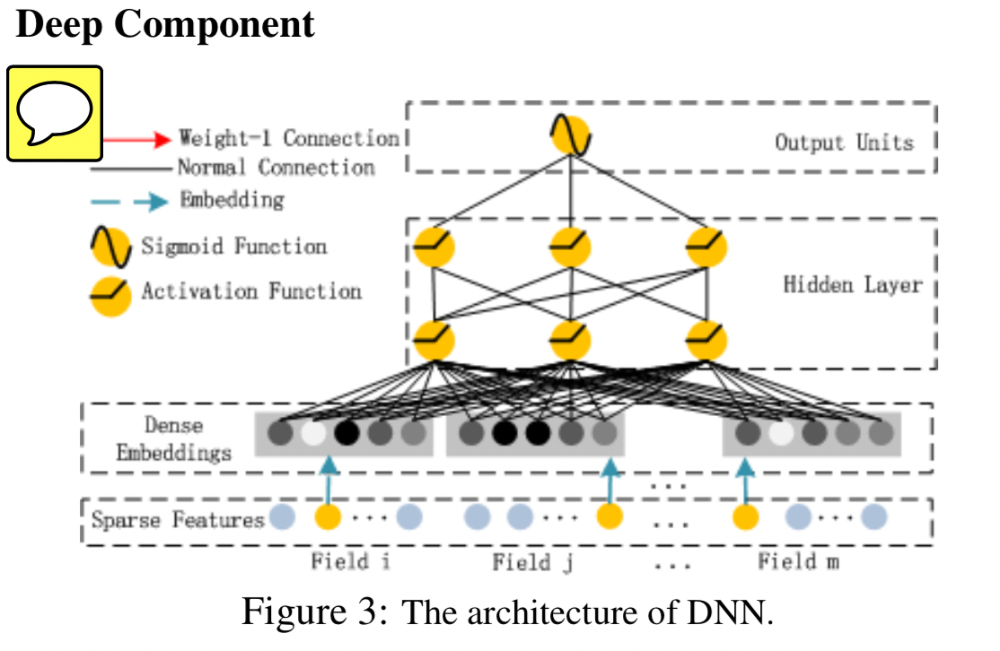

# DeepFM: A Factorization-Machine based Neural Network for CTR Prediction

## 链接

## 对该文章的印象：
- FM 部分扩展出一个field 维度[bs, fields, F]，每个样本在field 维度上做交互（内积 scalar ）（上三角阵）
- Deep 部分同样，在每个filed 上独立做 deep dense操作；最后再concat;
- 有两个部分组成
	- 1. FM component 

	- 2. deep component

