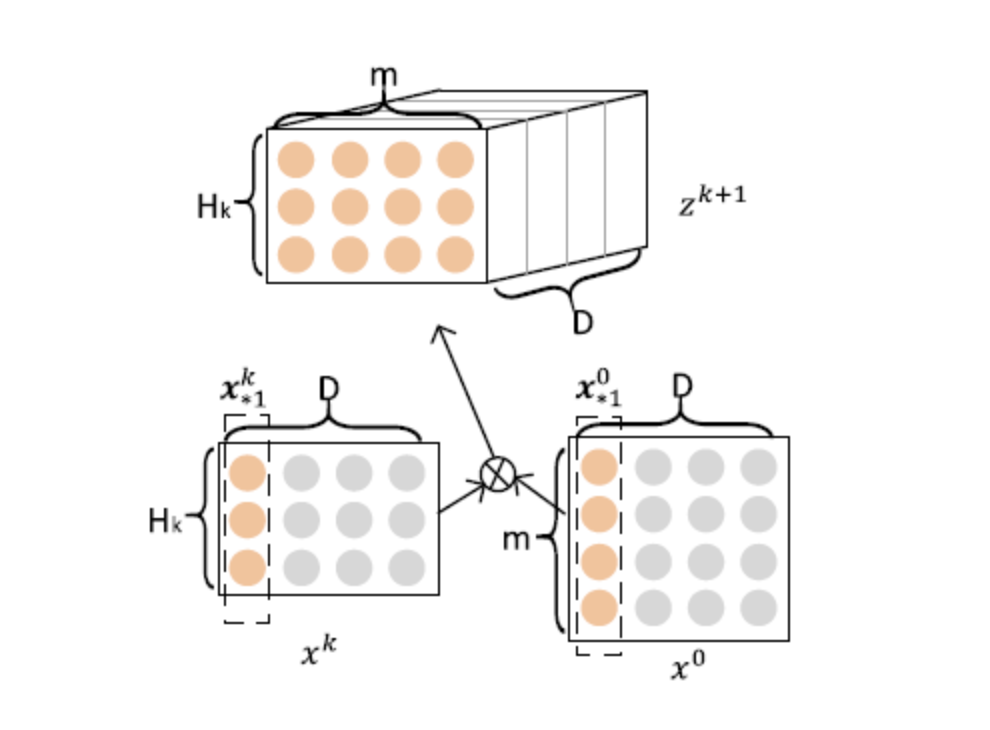
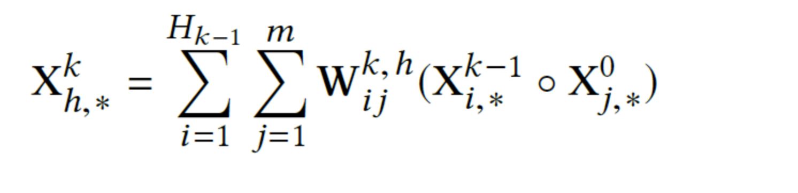
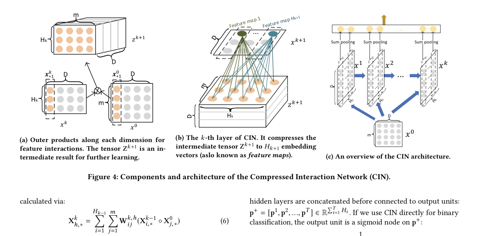

# xDeepFM: Combining Explicit and Implicit Feature Interactions for Recommender Systems

xDeepFM: Combining Explicit and Implicit Feature Interactions for Recommender Systems

## 链接

## 对该文章的印象：
- 这个公式看半天，初看之下应该是这样：
	- 公式里 元素相乘的两个大X, 分别代表 第一层X_0 和 每个更新后的层X_k, 跟DCN 递归结构一模一样；
	- 里面元素相乘，故shape不变，注意W_k_h, 代表第k个layer，第h个‘卷积核’（类比这个概念）， 先不管W看，每一次 这种运算： 得到一个D维向量，代表第h 个‘卷积核’ 的feature map; 那么最终结果是 shape = [H, D]
	- 以上是只看公式；
	- 注意，图与公式很难第一眼看出对应的，先独立去看；
		- 图是两步走，第一步是 求出立方体Z_k, 第二步是求X_k， 这两部对应整个公式；
		- 第一步需要做外积，'btf, byf --> btyf'
		- 卷积这里具体是： 卷积核是全部面积大小，但是维度只是2维，一次卷机操作，会把整个平面 变成一个点， 有H_k个卷积核，故变成一个长度为H_k的向量，有D个通道（人家本来是3D，可是你的卷积核是2D, 所以在第三个维度上独立做卷积操作），最后卷积操作 弄出 H_k*D 的平面, 这就是一个layer;
	- 再回头看公式，看那个W,  在想象卷积，是不是对应的，同一的？
- 代码实现上, 看好多人的源码(比如最下面)都是先reshape 成3D, input Z_k 本来是应该是4D的[bs,ts,ts, F] [只考虑layer=1], 然后3D输入配合 列卷积核【ts*ts, 1], 我实在看不懂怎么就能 用列卷积核了，
从我自己角度来看，工程上是可以按照我上面描述的去做的：立方体Z_k 3D矩阵，reshape 为2D, 只需要用一个 平面卷积核[ts2,F], 配合步长为 ts, 即可做到；
- [卷积](https://github.com/brakeman/general_pro/blob/master/FM/readfiles/torch_detail.md)
- 跟他们的源码比较来看，大家都先是展开为3D [bs,ts*ts, F], 区别就在 他们用列卷积核，而我用平面卷积核， 且，他们步长为1， 我步长为 ts; 因此，如果我对他们的代码没理解错，那么就是他们错了，在只用1个filter 的情况下，滑动 ts*ts 步，因此配合下面的图看，看CIN层（b）图，他们的feature map 1 长度绝不可能是D = ts, if layer = 1;

        # 他们的代码，假设layer = 1, ts =2, F=3, filter个数为1；
        # 按照论文所说，第一层 CIN 操作后应当有2个输出值；结果它有3个；
        conv = nn.Conv1d(4, 1, 1, stride=1) # 【单个卷积核行数, filter_num, 单个卷积核列数】
        a = torch.randint(2, (1,4,3)).type(torch.float32)
        x2 = conv(a)
        print(a)
        print(conv)
        print(x2)
        
        # 输出
        tensor([[[1., 1., 1.],
         [1., 0., 0.],
         [1., 0., 1.],
         [0., 1., 1.]]])
  
        Conv1d(4, 1, kernel_size=(1,), stride=(1,))
        tensor([[[-0.3542, -0.6679, -0.4820]]], grad_fn=<SqueezeBackward1>)
- 他们代码

        # 我的代码 
        conv = nn.Conv1d(1, 1, (2, 3), stride=2)
        print(conv)
        a = torch.randint(2, (1, 1, 4, 3)).type(torch.float32)
        x2 = conv(a)
        print(a)
        print(conv.weight)
        print(conv.bias)
        print(x2)
        
        # 输出:
        Conv1d(1, 1, kernel_size=(2, 3), stride=(2,))
        tensor([[[[1., 1., 0.],
                  [0., 0., 0.],
                  [1., 1., 1.],
                  [1., 1., 0.]]]])
        Parameter containing:
        tensor([[[[ 0.3108, -0.1124, -0.0978],
                  [ 0.3622, -0.3333,  0.0616]]]], requires_grad=True)
        Parameter containing:
        tensor([-0.2372], requires_grad=True)
        tensor([[[[-0.0388],
                  [-0.1077]]]], grad_fn=<MkldnnConvolutionBackward>)
- CIN 层：
- CIN 公式： 
- 整体： 

- 别人代码

        class CIN(nn.Module):
            '''xDeepFM CIN Module
            '''
            def __init__(self, params):
                super(CIN, self).__init__()
                # parse params
                self.split_half = params['split_half']
                self.field_size = params['field_size']
                self.hidden_dims = params['cin_hidden_dims']
                self.num_layers = len(self.hidden_dims)
                
                self.net_dims = [self.field_size]+self.hidden_dims
                self.hidden_dims_split_half = [self.field_size]
                self.conv1ds = nn.ModuleList()
                for i in range(self.num_layers):
        #             h_weights['h_weight%d' % (i+1)] = torch.empty(net_dims[i], self.field_size)
        #             nn.init.normal_(h_weights['h_weight%d' % (i+1)])
                    self.conv1ds.append(nn.Conv1d(self.net_dims[0]*self.hidden_dims_split_half[-1], self.net_dims[i+1], 1))
                    if self.split_half:
                        self.hidden_dims_split_half.append(self.net_dims[i+1] // 2)
                    else:
                        self.hidden_dims_split_half.append(self.net_dims[i+1])
                
            def forward(self, inputs):
                res = []
                h = [inputs]
                for i in range(self.num_layers):
                    temp = torch.einsum('bhd,bmd->bhmd', h[-1], h[0])
                    temp = temp.reshape(inputs.shape[0], h[-1].shape[1]*inputs.shape[1], inputs.shape[2])
                    # b * hi * d
                    temp = self.conv1ds[i](temp)
                    if self.split_half:
                        next_hidden, hi = torch.split(temp, 2*[temp.shape[1]//2], 1)
                    else:
                        next_hidden, hi = temp, temp
                    h.append(next_hidden)
                    res.append(hi)
                res = torch.cat(res, dim=1)
                # b * (h1 + h2 + ... + hn)
                res = torch.sum(res, dim=2)
                return res