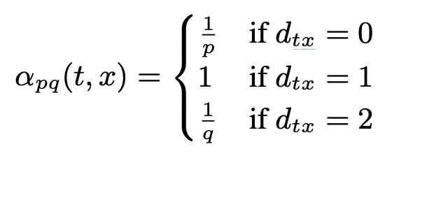
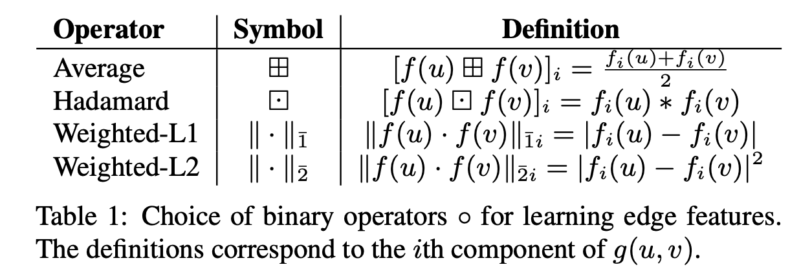

# node2vec
## 链接
[https://cs.stanford.edu/~jure/pubs/node2vec-kdd16.pdf](https://cs.stanford.edu/~jure/pubs/node2vec-kdd16.pdf)
## 对该文章的印象：
- skip gram  [u] --> neighs(u)
- 负采样 损失 ui, uj 之间越远越好， ui, neighs(ui) 之间越近越好
- 目的是node embedding 
- 采样的时候，老以为只是广度搜索（只认为1度邻居是邻居），忽略了深度搜索（ui, uj 在结构上的相似性，例如 两个黑中介节点，是相似的，但不一定是一度邻居）
- 本文的核心就是采样，2度随机游走，α_pq(t, x) 由p,g两个参数控制广度，深度搜索的力度； 图1；
- 也可以做 edge embedding, 也可以做边预测；g(emb(u), emb(v)) 编码成一纬向量，选择，比如，图2；
- 从源码上看，直接调用了gensim w2v 做最终的训练，当然是合理的；
- 最大的弊端是 泛化问题，like things in w2v， u never know emb of unknown tokens;                          
