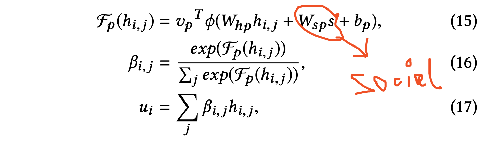

# Rumor Detection with Hierarchical Social Attention Network

## 粗读
- 主要关注文本；
- 提出了  post 级别(单个post)， event 级别（源post+repost+comments）；本文也是瞄准了event level;
- 仍然是 全联接形式的attention 机制；bi-lstm+attention 把句子编码为att 加权vec；因为本文是 event级别，故同样的套路，把event 编码 为 att 加权vec；
- 把 social feat 纳入到att 机制中，记下；