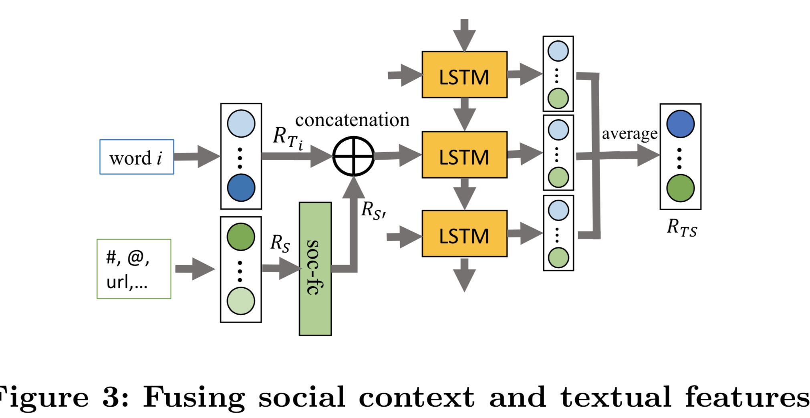
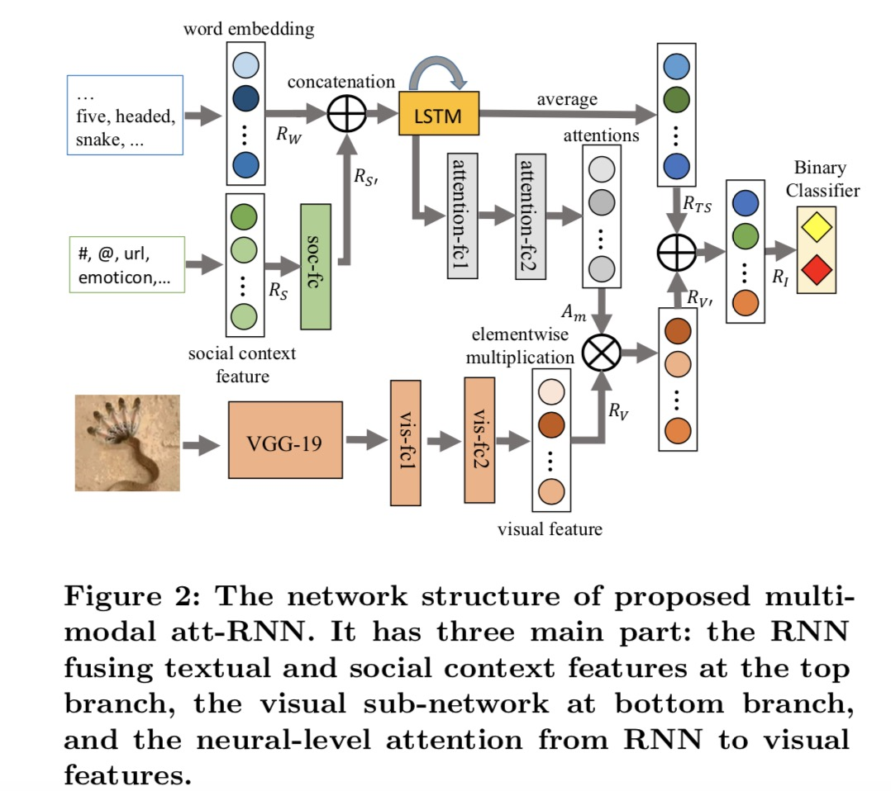

# Multimodal Fusion with Recurrent Neural Networks for Rumor Detection on Microblogs

## 印象
- text features, social context features and image features
- RNN attention fuse mechenism;
    - part1 fuse the text and social context with a RNN, which generates a joint representation RTS for these two modalities. 理解；
    - part2 For a visual feature RV , it is gained through a deep CNN. 理解
    - part3 We use the attention from the RNN’s output at each time step to further refine RV. 理解
    - In the last step, both RT S and attention-aggregated RV′ are concatenated as the final multimodal representation RI. 理解
    
    
## 粗读疑惑推敲
- fuse the text and social context with a RNN； 具体值哪种方式？
    - text:   [bs, ts, F]
    - social: [bs, F]
    - 可能性1：bs,ts,2F
    - 可能性2：bs, ts+1, F
- 从图上看， 应该是第一种; 
- 从图上看，[bs,ts,2F] 经过lstm 后，mean pooling along ts dim; 得到【bs, F】

- We use the attention from the RNN’s output at each time step to further refine RV. 具体指什么？
    - 经过lstm, [bs, ts, f], 直接全联接为【bs, ts, 512】, 512 对应的是visual part 的输出向量维度；【bs. 512】
    - bs, ts, 512， 在最后一个dim 做softmax 得到att score;
    - [bs, ts, 512] * [bs,1， 512] 这样每个(词汇)ts, 都att融合了图片信息，再加上在part1中每个词汇融合了social context, 因此本文在词汇级别融合了多域信息；
    - 上诉操作 是个pooling 操作，最终变为【bs. ts】
    - 

