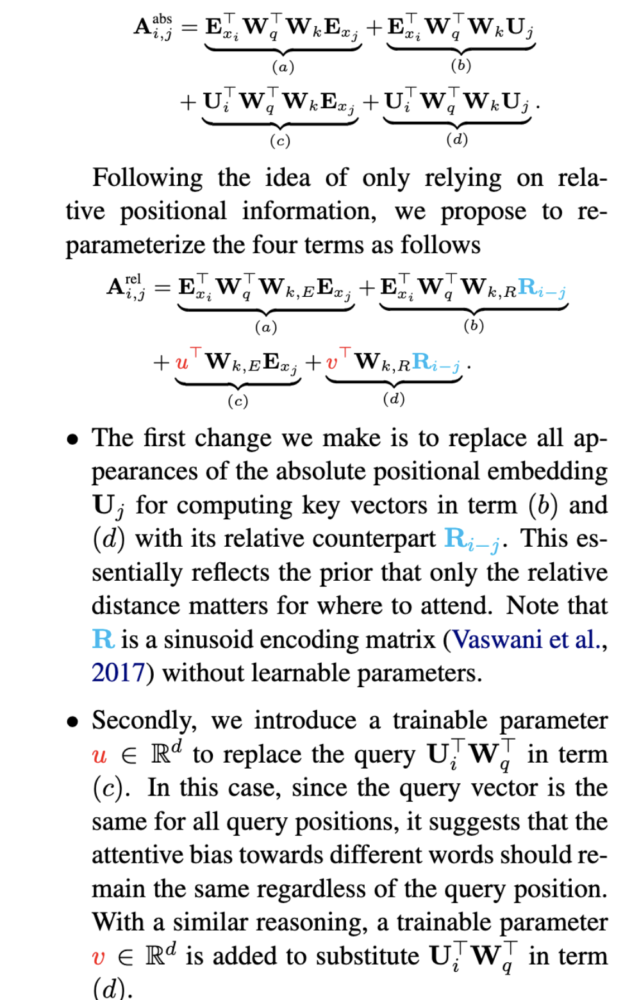

# XL-NET
## 链接
[https://arxiv.org/pdf/1906.08237.pdf](https://arxiv.org/pdf/1906.08237.pdf)
## 问题导向
- bert 有什么问题？
	- bert 作为自编码系统， 其mask 机制
		- 1.损害了 预训练和 fine-tuning 的一致性
		- 2.消解了mask内容之间的依赖性，p(mask1| mask2, context), P(mask2|mask1, context);预测一方的时候，看不到另一方；
- xl_net 怎么解决bert 的问题
	- 通过PLM 的方式； 既能双向，又不会消解mask 内容之间的依赖性；
- xl_net 引入了哪些麻烦
	- 无法用传统的trfm 结构了，因为传统的trfm 无法建模：P(x_t|x_1, x_2, .., x_t-1，position_x_t)
	- 上面公式中 传统transformer 的pos_emb 被直接杂糅到输入端，无法单独拉出来Pos_x_t; 且不能不瞅 x_t;
	- 排列组合的方式虽然能瞅到两端信息，但是具体工程上实现很trick（记下），因为你不可能在输入端就排列组合，否则预测的时候怎么办？；
- xl_net 怎么解决引入的麻烦
	- 双流transformer 架构
	- mask 矩阵trick
	- 相对位置编码
		
- xl_net 源码阅读
- 关于新颖的样本间 记忆机制；
	- 从源码看 记忆在样本间传播; 
	【A, sep, B, sep, cls】-->【A, sep, B, sep, cls】--> ...
	
			mems = None
			for feature in features:
					logits, mems = model(mems, ....)
					lm_loss = criterion(logits.transpose(1, 2), target)

	- 同时，mask矩阵 随着不同的feature（样本） 做初始化（ts,ts,bs）后, 再进入双流att 之前做concat()， mems_mask 全零代表可以被任何当前time step看到；
	
			mems_mask = torch.zeros([data_mask.shape[0], mlen, bsz],  
				                     dtype=torch.float32)  #[ts, ts+m, bs]
			data_mask = torch.cat([mems_mask, data_mask], dim=1)

###  xl_net 源码阅读
	**1. 拿到双流的两个mask 矩阵（attn_mask， non_tgt_mask）；**
- attn_mask #以perm_mask 为基础，为0的元素代表对应行可以看到对应列（i,j）信息；加上上三角中阵代表，加入新的限制，代表前面元素无法看到后面元素；
	- perm_mask = self_local_perm() # 见印象 图片；# 
	- attn_mask = self._create_mask(qlen, mlen) # 上三角矩阵
	- data_mask = perm_mask
	- attn_mask += data_mask[:, :, :, None]
	- attn_mask = attn_mask.gt(0)
- non_tgt_mask
	- non_tgt_mask = -torch.eye(qlen, dtype=torch.float32) # [qlen, qlen]  
    - non_tgt_mask = torch.cat([torch.zeros([qlen, mlen], dtype=torch.float32),non_tgt_mask], dim=-1)  # ts=0的时候，mlen=0, 故没有任何操作；
    - non_tgt_mask = (attn_mask + non_tgt_mask[:, :, None, None]).gt(0).type(dtype=torch.float32) # 这一步给原来的attn_mask 对角线上全部加了-1， 再gt（0）使得对角线全0，其他不影响，注意，源码中所有att_mat 元素为0代表 可以看到，为1代表看不到，故对角线元素现在可以看到自己了；
    
** 2. 拿到双流的两个输入 g_0, h_0

		word_emb_k:torch.Size([512, 1, 32])
		word_emb_q:torch.Size([85, 1, 32])
		# q 不是 k 子集吗？
		# 不是，K 是正统 lookup table 查出来的，
		# Q 只是随机初始化的，形如 ts,bs,F 的矩阵；
		init_g_shape:torch.Size([85, 1, 32])
		init_h_shape:torch.Size([512, 1, 32])
	    if target_mapping is not None:  
	        word_emb_q = self.mask_emb.repeat(target_mapping.shape[0], bsz, 1)  
	 
		# target_mapping: float32 Tensor in shape [num_predict, len, bsz].  
	    # If target_mapping[i, j, k] = 1, the i-th predict in batch k is on the j-th token.
** 3. 拿到 Segment embedding

	mem_pad = torch.zeros([mlen, bsz], dtype=torch.int32)  
	cat_ids = torch.cat([mem_pad, seg_id], dim=0)  
	#seg_id: int32 Tensor in shape [len, bsz], the input segment IDs.
	seg_mat = (~torch.eq(seg_id[:, None], cat_ids[None, :])).type(torch.long)  
	seg_mat = torch.eye(2, dtype=torch.float32)[seg_mat]
	# seg_mat:torch.Size([512, 512, 1, 2]) # 意思是先看i,j是否在同一个segment 中，然后再最后一个纬度展开为one-hot 形式；

** 4. Positional encoding  

	pos_emb = self.relative_positional_encoding(  
	    qlen, klen, self.d_model）
	# 函数内部如下；    
	freq_seq = torch.arange(0, d_model, 2.0)  #想用多少个（d_model）个纬度来编码每一个位置信息；
	inv_freq = 1 / (10000 ** (freq_seq / d_model))  
	beg, end = klen, -qlen  
	fwd_pos_seq = torch.arange(beg, end, -1.0)  #从正到负
	pos_emb = self.positional_embedding(fwd_pos_seq, inv_freq)  

	def positional_embedding(self, pos_seq, inv_freq):  
	    sinusoid_inp = torch.einsum('i,d->id', pos_seq, inv_freq)  
	    pos_emb = torch.cat([torch.sin(sinusoid_inp), torch.cos(sinusoid_inp)], dim=-1)  
	    pos_emb = pos_emb[:, None, :]  
        return pos_emb
   
  ** 5. 记忆机制

	def _cache_mem(self, curr_out, prev_mem, mem_len, reuse_len=None):  
        curr_out = curr_out[:reuse_len]  
        if prev_mem is None:  
            new_mem = curr_out[-mem_len:]  
        else:  
            new_mem = torch.cat([prev_mem, curr_out], dim=0)[-mem_len:]  
        return new_mem

** 6.  开始双流编码

	self.seg_embed = nn.Parameter(torch.randn(self.n_layer, 2,  
	                                          self.n_head, self.d_head))
	                                          
	output_h, output_g = self.two_stream_rel_attn(  
	    h=output_h,   # 代表 lookup_table(inp_k)【ts,bs,F】
	    g=output_g,  # 代表self.mask_emb.repeat(target_mapping.shape[0], bsz, 1) 
	                 ## target_mapping: float32 Tensor in shape [num_predict, len, bsz].  
	                 ## If target_mapping[i, j, k] = 1, the i-th predict in batch k is on the j-th token.
	    r=pos_emb,  
	    r_w_bias= self.r_w_bias[i],  
	    r_r_bias= self.r_r_bias[i],  
	    seg_mat=seg_mat,  
	    r_s_bias=r_s_bias_i,  
	    seg_embed=seg_embed_i,  
	    attn_mask_h=non_tgt_mask,  
	    attn_mask_g=attn_mask,  
	    mems=mems[i],  
    target_mapping=target_mapping)

具体函数

	def two_stream_rel_attn(self, h, g, r, mems, r_w_bias, r_r_bias, seg_mat, r_s_bias,  
	                        seg_embed, attn_mask_h, attn_mask_g, target_mapping):  
  
	    scale = 1 / (self.d_head ** 0.5)  
	    if mems is not None and len(mems.size()) > 1:  
	        cat = torch.cat([mems, h], dim=0)  
	    else:  
	        cat = h  
	    k_head_h = self.head_projection(cat, 'k')  
	    v_head_h = self.head_projection(cat, 'v')  
	    k_head_r = self.head_projection(r, 'r')  
	    q_head_h = self.head_projection(h, 'q')  
	    attn_vec_h = self.rel_attn_core(  
	        q_head_h, k_head_h, v_head_h, k_head_r, seg_embed, seg_mat, r_w_bias,  
	        r_r_bias, r_s_bias, attn_mask_h, scale)  
	    output_h = self.post_attention(h, attn_vec_h)  
	  
	    q_head_g = self.head_projection(g, 'q')  
	    q_head_g = torch.einsum('mbnd,mlb->lbnd', q_head_g, target_mapping)  
	    attn_vec_g = self.rel_attn_core(  
	        q_head_g, k_head_h, v_head_h, k_head_r, seg_embed, seg_mat, r_w_bias,  
	        r_r_bias, r_s_bias, attn_mask_g, scale)  
	    attn_vec_g = torch.einsum('lbnd,mlb->mbnd', attn_vec_g, target_mapping)  
	    output_g = self.post_attention(g, attn_vec_g)  
	  
	    return output_h, output_g

输出数据流

	##############--------------------___############################
	h:torch.Size([512, 1, 32])
	g:torch.Size([85, 1, 32])
	r:torch.Size([1024, 1, 32])
	seg_mat:torch.Size([512, 512, 1, 2])
	seg_emb:torch.Size([2, 4, 8])
	attn_mask_h:torch.Size([512, 512, 1, 1])
	attn_mask_g:torch.Size([512, 512, 1, 1])
	target_map:torch.Size([85, 512, 1])
	cat:torch.Size([512, 1, 32])
	k_head_h:torch.Size([512, 1, 4, 8])
	v_head-h:torch.Size([512, 1, 4, 8])
	k_head-r:torch.Size([1024, 1, 4, 8])
	q_head_h:torch.Size([512, 1, 4, 8])

多个样本（for feature in features）之后：

	##############--------------------___############################
	h:torch.Size([512, 1, 32])
	g:torch.Size([85, 1, 32])
	r:torch.Size([1408, 1, 32])
	seg_mat:torch.Size([512, 896, 1, 2])
	seg_emb:torch.Size([2, 4, 8])
	attn_mask_h:torch.Size([512, 896, 1, 1])
	attn_mask_g:torch.Size([512, 896, 1, 1])
	target_map:torch.Size([85, 512, 1])
	mems:torch.Size([1, 32])
	cat:torch.Size([896, 1, 32])
	k_head_h:torch.Size([896, 1, 4, 8])
	v_head-h:torch.Size([896, 1, 4, 8])
	k_head-r:torch.Size([1408, 1, 4, 8])
	q_head_h:torch.Size([512, 1, 4, 8])

继续内部函数
  
	def rel_attn_core(self, q_head, k_head_h, v_head_h, k_head_r, seg_embed, seg_mat,  
	                  r_w_bias, r_r_bias, r_s_bias, attn_mask, scale):  
	  
	    ac = torch.einsum('ibnd,jbnd->ijbn', q_head + r_w_bias, k_head_h)  
	    bd = torch.einsum('ibnd,jbnd->ijbn', q_head + r_r_bias, k_head_r)  
	    bd = self.rel_shift(bd, klen=ac.shape[1])  
	    ef = torch.einsum('ibnd,snd->ibns', q_head + r_s_bias, seg_embed)  
	    ef = torch.einsum('ijbs,ibns->ijbn', seg_mat, ef)  
	    attn_score = (ac + bd + ef) * scale  
	    attn_score = attn_score - 1e30 * attn_mask  
	    attn_prob = F.softmax(attn_score, dim=1)  
	    attn_prob = self.DropAttn(attn_prob)  
	    attn_vec = torch.einsum('ijbn,jbnd->ibnd', attn_prob, v_head_h)
	    return attn_vec

## 关于
