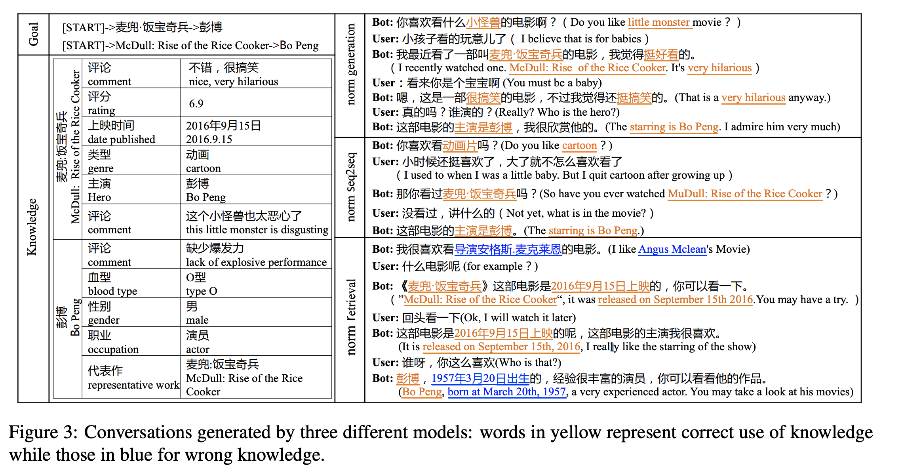
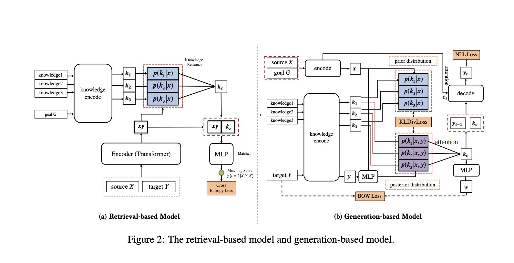

## Proactive Human-Machine Conversation with Explicit Conversation Goals

### 
- proactively leading the conversation
- For example, when humans talk
about movies, if one person learns more about
some movies, he/she usually leads the conversation based on one or more entities in the background knowledge and smoothly changes the topics from one entity to another. In this paper, we
mimic this process by setting an explicit goal as
a knowledge path “[start] → topic a → topic b”
- 

### models
- 2 models 
- 

