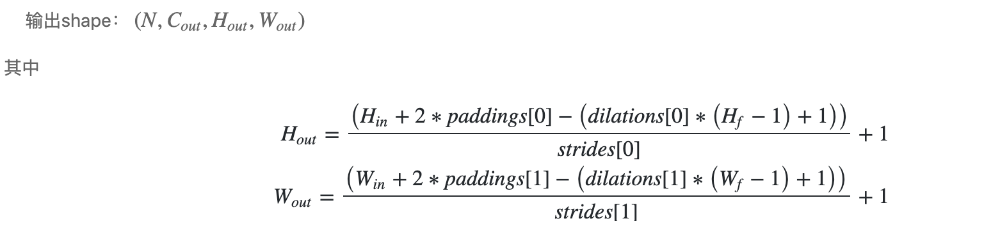
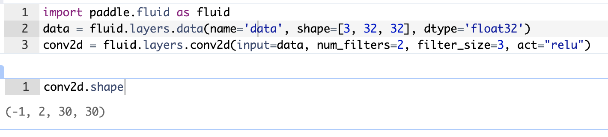
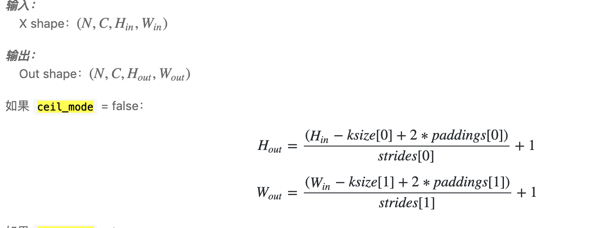

## paddle 笔记

- 理解数据传输流程
    - reader --> rand_noise_reader(reader) --> batch_reader
    -       batch_reader = paddle.batch(reader, 10)
    - d

- conv2d
	- 输入和输出是NCHW格式
	- 如果组数大于1，C等于输入图像通道数除以组数的结果
	- 滤波器shape： (C_out,C_in,H_f,W_f)
	- 
	- 
	- 理解一下 默认padding=0, dilation=1, stride=1; 
	- 30 = (32+0-1*(3-1)+1)/1  + 1
	
- pool2d
	- 默认参数 stride =1, padding=0
	- 
	
	

