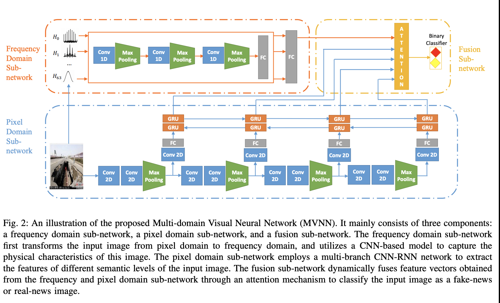

# Exploiting Multi-domain Visual Information for Fake News Detection

## 粗读
- 主要关注 图片，假图片包含两种：ps过，图文不一致的；
- 假图片往往不清晰，block effect;  反映在频域上就会很明显；
- 模型结构三部分： 频域，空间域， 融合；
- 频域：先用DTC 将图片转为频域；得到64个wave; 然后1D Fourier transform; 然后采样出64个向量；然后用一个共享CNN参数 对每个向量独立 处理， 得到64个表达；然后concat 出一个1D向量 ![频域]
- 空域： multi-branch cnn-rnn network; 顶层特征+底层特征 全都要；1*1 conv；Gate 机制；
- 融合： attention 机制之全联接形式； 每个特征向量坍塌成一个点，然后就计算出了 att_score;

## 总结
- 这论文是针对图片做虚假检测点， 图片的频域分析很好， multi-branch cnn-rnn network， attention；
- 

