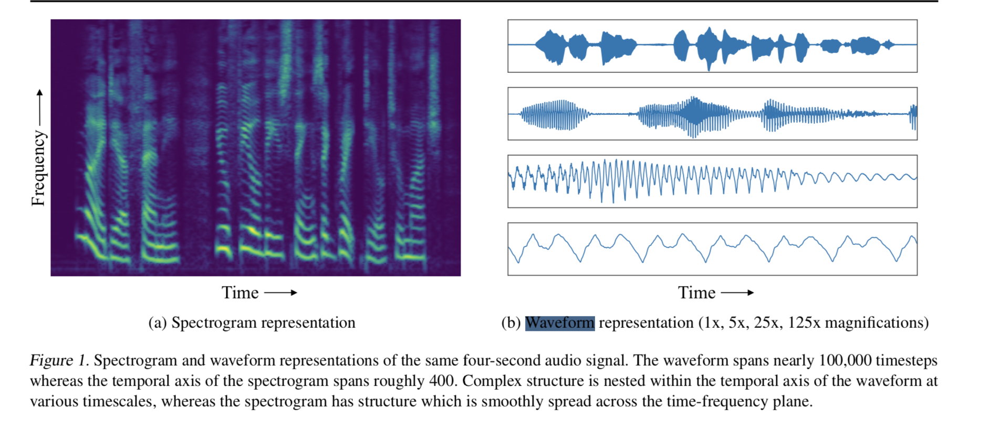

# MelNet: A Generative Model for Audio in the Frequency Domain

## 粗读
- single second of audio spans tens of thousands of timesteps；
- 2D time-frequency representations such as spectrograms; 频谱图：【y振幅，x频率】；
- 1D Waveform；
- waveNet typically only backpropagate through a fraction of a second; 受限于秒级别样本，缺乏长期依赖；
- 隐患：虽然样本对象变为频谱可以**提高长期依赖**，但是有降低局部依赖的风险，可能导致 低质量的 音频生成；这也是之前 语音生成领域 只用waveform 而不用 spectrograms 的原因；
- To reduce information loss, we model high-resolution spectrograms which have the same dimensionality as their corresponding time-domain signals.
- To limit oversmoothing, we use a highly expressive autoregressive model which factorizes the distri- bution over both the time and frequency dimensions.
- Modelling both fine-grained details and high-level structure in high-dimensional distributions is known to be challeng- ing for autoregressive models. 自回归模型很难拟合又细节又宏观这样综合的分布；
- A subsampled spectrogram that captures high-level structure is generated initially, followed by an **iterative up-sampling procedure** that adds high-resolution details.