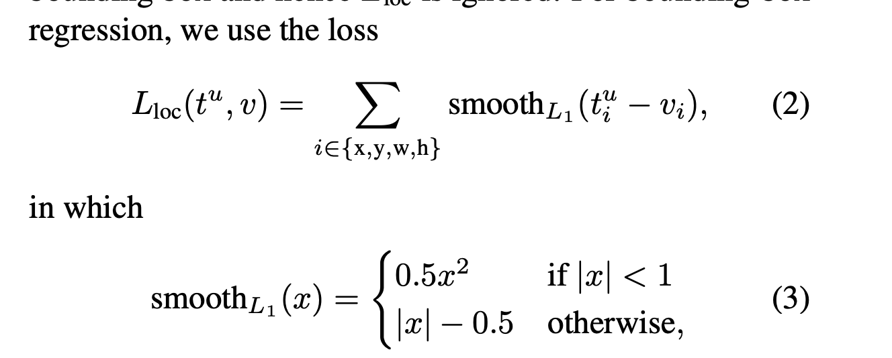

# Fast R-CNN

## 链接

## 对该文章的印象：
- 目标检测 
    - 几个概念： 
        - “proposals”：candidate object locations；
        - RoI：region of interest, 每张图片会实现采样一些子图，子图是有label（正例负例）：（IoU>0.5）；
        - SVMs： 受益于hard examples: 最大化最小距离；
        - Bbox：定位框： 一组(x,y,w,h)数据，其中x,y代表着bbox的左上角(或者其他固定点，可自定义)，对应的w,h表示bbox的宽和高
        - IoU：区域交集
        - multi-stage vs single-stage, 本文是single; R-CNN & SPPnet multi-stage;

        - mAP： 最终评估指标，假设目标共两类，猫狗，模型每张图片输出一个proposal, 如果 IoU>0.5， 认为输出正确， 那么猫的精度 = 预测正确的图片数/猫的图片总数， 狗也是这样，mAP 是他们的平均；
    
- 本文是R-CNN & SPPnet 后续论文
- 训练机制： 每张照片采样N个子图（RoI）， 包含正例负例；
- 多任务： 分类+回归
    - 分类是 目标属于那一类；
    - 回归是 认为 proposals Bbox 和 groud truth Bbox 之间是线性关系，那么可以模拟为回归问题；
    具体公式如图：

- 模型结构 还没看懂； 整体见图：
