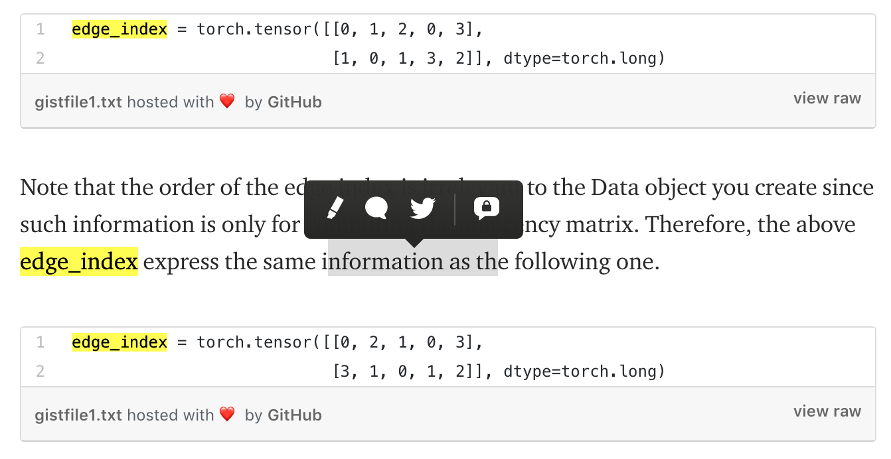
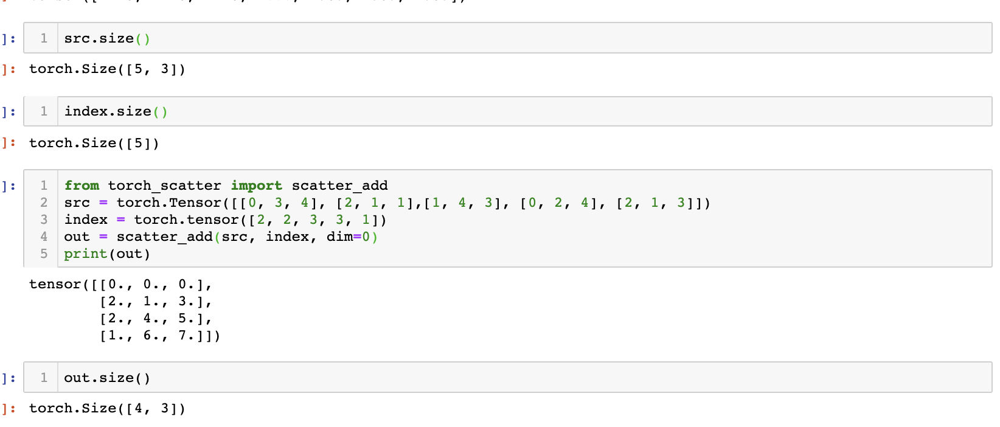

# pyG 解析
核心是MessagePassing类
其中最关键的是 scatter_系函数，例如scatter_add(out, edge_index)  
### edge_index 

	out = torch.index_select(node_Embedding_mat, edge_index[idx])  # index_select 可能会复制一个点多次；
	out = scatter_add(out, edge_index[i])  # 这里edge_index见图

看这个例子，5个点，每个点N_dim=3;
对于0号位， 找不到，故0vec
对于1号位， 最后一个，故【2，1，3】
对于2号位，前俩，故【0，3，4】+【2，1，1】
没错啊，就是这个逻辑啊；
 我是target_node, 谁指向我，谁就是我的邻居，被我agg_scatter;

 ### 这样想：
 edge_index.Transopose 例如为 
 [0,1]
 [1,2]
 [3,2]
 [2,3]

 第一列代表src, 第二列代表target;
 左侧第一列经过 torch.index_select(node_Embedding_mat, edge_index[0]) 后
 从idx 变成 实际向量
 [emb_0]
 [emb_1]
 [emb_3]
 [emb_2]

 这个作为scatter_add 第一个参数；
 第二个参数是 edge_index[1] = 【1，2，2, 3】, 代表target

 那么 先看 
0号位： 在target中找不到，说明没有邻居指向它；
1号位： 在target中对应第一个，即它邻居是emb_0
2号位： 在target中对应第二行，第三行， 
3号位： 。。。

### pyG 的优势
一步到位把 sample and agg 通过scatter_add 系函数解决了，尤其是解决叠加多个layer 就可以[直接解决多度采样和聚合]的问题，太tm方便了，具体看下面代码，对一个batch 来说，它的edge_batch_index是永远不变的，每叠加一个GCNlayer,就更新x (emb_lookup_table)，当然是合理的。
- 正过来想，给定target nodes [bs], edge_index, Embedding_lookup_table; 真的是一步到位， scatter_add解决了
- 反过来，如果按照正常思路， 给定 target_nodes [bs], 首先需要采样邻居，采样完需要聚合，例如GCN 需要AH, 需要构建A, 等等等等。 

怎么更新的？
看下面代码
- 一次GCN 把 x给更新了，换句话说，更新的是embedding_lookup_table. 当然合理
- 另外，担心最大的内存开销是这个 tmp = torch.index_select(tmp, dim, edge_index[idx])
担心它会生产出一个 num_edges * F 的爆炸矩阵；
可是应该可以避免使用全部的边的，把num_edges 变成 num_batch_edges;
完全可以；看两个例子，分别用了batch 和真个epoch;
- 另外，我当时遇到的内存开销问题，当然可以绕开啊，我当时的问题其实就是用了epoch模式，而没有用batch模式的问题；

#### batch 级别；

	batch_size= 512
	train_loader = DataLoader(train_dataset, batch_size=batch_size)

    def forward(self, data):
        x, edge_index, batch = data.x, data.edge_index, data.batch

	def train():
	    model.train()

	    loss_all = 0
	    for data in train_loader:
	        data = data.to(device)
	        optimizer.zero_grad()
	        output = model(data)

	        label = data.y.to(device)
	        loss = crit(output, label)
	        loss.backward()
	        loss_all += data.num_graphs * loss.item()
	        optimizer.step()
	    return loss_all / len(train_dataset)

#### 整个epoch 级别

	data = dataset[0].to(device) # 代表用了全部样本；

	model.train()
	for epoch in range(200):
	    optimizer.zero_grad()
	    out = model(data)
	    loss = F.nll_loss(out[data.train_mask], data.y[data.train_mask])
	    loss.backward()

	class Net(torch.nn.Module):
	    def __init__(self):
	        super(Net, self).__init__()
	        self.conv1 = GCNConv(dataset.num_node_features, 16)
	        self.conv2 = GCNConv(16, dataset.num_classes)

	    def forward(self, data):
	        x, edge_index = data.x, data.edge_index

	        x = self.conv1(x, edge_index)
	        x = F.relu(x)
	        x = F.dropout(x, training=self.training)
	        x = self.conv2(x, edge_index)

	        return F.log_softmax(x, dim=1)