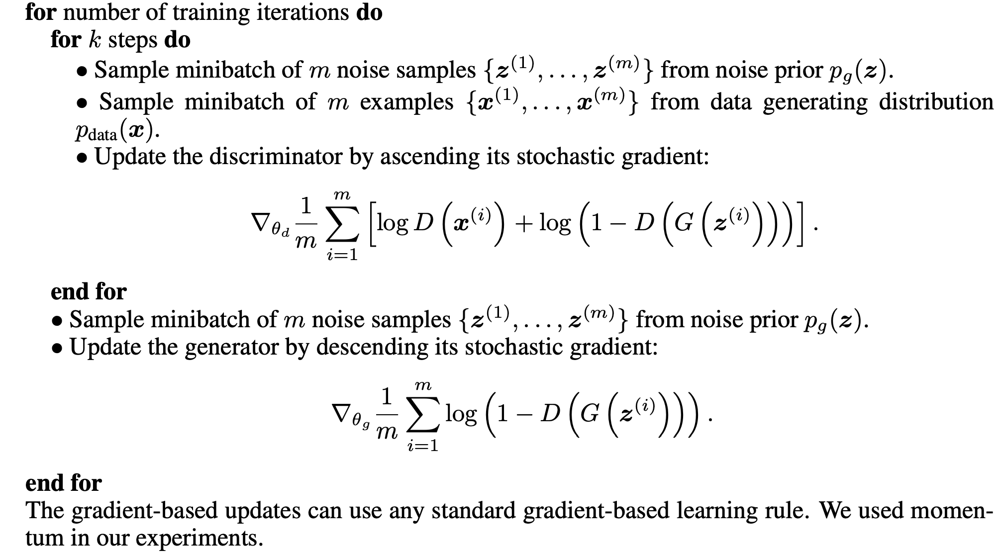

## Generative Adversarial Nets

####印象
- 一句话总结就是，对抗是两方面的对抗：
    - 判别器模块希望 真就是真，假就是假；
    - 生成器模块希望 假就是真；
    - 收敛到一个稳定状态, 成就两个master, 最强的矛 vs 最强的盾;
     
- 判别损失函数： 这个损失函数不是标准的交叉熵损失函数，而是两个交叉熵拼起来的，仔细看，如果按梯度上升来说，希望梯度越大越好，那么等价于期望
    - D(xi) 这个真样本的logits 越大越好
    - D(G(zi)) 这个假样本的logits 越小越好；
- 生成器损失函数：这个损失函数同样，不是标准的交叉熵，而是反向交叉熵（标准的是y*log(y_estimate)， 这里是y*log(1-y_estimate)）；
    - 在判别器参数冻结后，梯度下降情况下，希望梯度越小越好，等价于期望:
        - D(G（zi）)生产的logits 越大越好; 可是我们的判别器已然这么牛逼，对于假样本zi,它当然倾向于生成极小的logit(即D(G(zi)));
        - D参数已经冻结，为了生成这么小的logits, 必然只能靠G(zi) 模块了，所以这里在更新生成器参数；
         
- 更新过程：

#### csdn示例代码

    # GAN     
    discriminator.trainable = False # 为了更新生成器参数，定义的GANmodel不可更新判别器参数；判别器参数自己单独训练;
    gan_input = keras.Input(shape=(latent_dim,))
    gan_output = discriminator(generator(gan_input)) # 2分类；
    gan = keras.models.Model(gan_input, gan_output)
    gan.compile(optimizer=gan_optimizer, loss='binary_crossentropy')
    
    # Train
    for step in range(iterations):
        random_latent_vectors = np.random.normal(size=(batch_size, latent_dim))
        generated_images = generator.predict(random_latent_vectors)
        combined_images = np.concatenate([generated_images, real_images])
        labels = np.concatenate([np.ones((batch_size, 1)),
                                np.zeros((batch_size, 1))])

        # 训练鉴别器（discrimitor）
        d_loss = discriminator.train_on_batch(combined_images, labels)
        
        # 在潜在空间中采样随机点
        random_latent_vectors = np.random.normal(size=(batch_size, latent_dim)
        misleading_targets = np.zeros((batch_size, 1))
        
        # 训练生成器（generator）（通过gan模型，鉴别器（discrimitor）权值被冻结）
        a_loss = gan.train_on_batch(random_latent_vectors, misleading_targets)