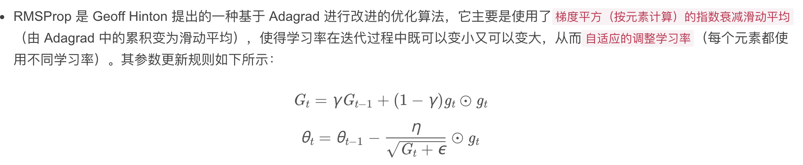

## 优化简单复习

### 总图

### ada_grad 自适应改变学习率 要懂，因为是关键节点，它引出了后面的 RMS_PROP & Ada_delta

- 关键看分母， 分母越大， 整体lr 越小，这是此算法特点，只会小，不会大；

### RMS_PROP 优化了上述算法；

- 关键看分母， 分母越大， 整体lr 越小，这是此算法特点；跟ada_grad一样；
- 区别在于，moving average 思想 取代原来的 平方累积思想， 使得lr可大可小；
	-- 当g_t 在t时刻很小时，相对于t-1时刻， 是会变小的啊，因为是 gamma * G_t + (1-gamma) * gt_2, 当gt_2 不足够大时，比如说0， gamma = 0.9, 则 此时公式就是 0.9*G_t; 相比于上一刻边小了，分母变小了，那么整体lr 变大；

### adam 结合了 滑动平均&自适应学习率调整；

站在RMS_PROP	基础上，rms_prop 只会自适应地调整lr, 虽然其中使用了moving average思想，但这个思想并没有体现在使用动量上， 现在Adam 升级了，它使用了动量，用一阶距

