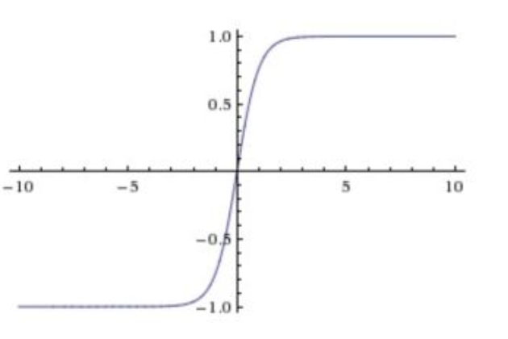

# ImageNet Classification with Deep Convolutional Neural Networks

## 印象
- 5层卷积+3层FC
- 局部响应归一化LRN：后来不再用了； VGG-11 (LRN) obtains 10.5% error rate, is the one with additional local response normalization (LRN) operation suggested by AlexNet. By comparing VGG-11 and VGG-11 (LRN), the error rate doesn’t improve which means LRN is not useful. In fact, LRN is not used any more in later on deep learning network, instead, batch normalization (BN) is used.

- dropout; 用于最后三层全联接；因为全联接是最容易过拟合的； To reduce overfitting in the fully-connected layers;训练时使用Dropout随机忽略一部分神经元，以避免模型过拟合。Dropout虽有单独的论文论述，但是AlexNet将其实用化，通过实践证实了它的效果。在AlexNet中主要是最后几个全连接层使用了Dropout。

- GPUs:We wrote a highly-optimized GPU implementation of 2D convolution
- relu > tanh
    - 显示 6倍加速拟合；
    - 原因在于 saturating （神经元饱和）, tanh 函数 使得数据被压缩在（-1，1）之间，那么当处在两端范围时，我们说此时是饱和的，从图上看，梯度几乎为0
    - relu 不会导致 饱和, 但是这里有个门机制，负数信号不传递，此时导数为0，不会更新参数；
    - 
  

- Overlapping Pooling： pooling 层要求重叠，只需要pool_size > stride;This scheme reduces the top-1 and top-5 error rates by 0.4% and 0.3%,