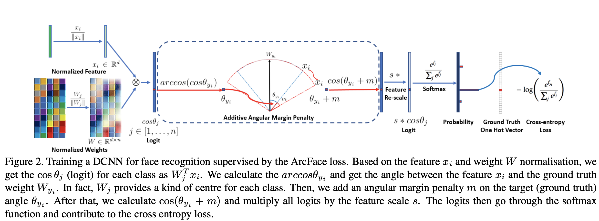

## ArcFace

1. 四个基本损失模块；
(A) Margin-Loss:
insert a geodesic distance margin between the sample and centres. 

(B) Intra-Loss: decrease the geodesic distance between the
sample and the corresponding centre. 

(C) Inter-Loss: increase the
geodesic distance between different centres. 

(D) Triplet-Loss: insert a geodesic distance margin between triplet samples. 

2. 两个方向baseline for Face Rec：
softmax loss用来直接区分 类间距； 缺点: 不怎么管理类内紧凑性；类太多了不好处理；仅封闭集有效，开放集无效；
triplet loss用来优化类内&类间特征； 缺点：组合爆炸，每个样本都要找一堆正负例子；

3. SphereFace 奇思妙想： W；
SphereFace assumes that the linear transformation matrix in the last fully connected layer
can be used as a representation of the class centres in an angular space

4. ArcFace 理解了

	- W，x_i normlize, 在normlize的情况下，cosine simi == dot product
	- 反三角函数，得到 Gt & x_i 之间角度，
	- 角度1+角度2， 然后cos， 角度1代表 x_i 与 Gt 角度， 角度2为了 区分同类不同例；
		- As the embedding features are distributed around each feature centre on the hypersphere, we add an additive angular margin penalty m between xi and Wyi to simultaneously enhance the intra-class compactness and inter-class discrepancy
	- 然后s*, s相当于球半径，半径越大，那么球的表面积越大，越可以容纳更多信息；
	- 然后标准softmax 交叉熵