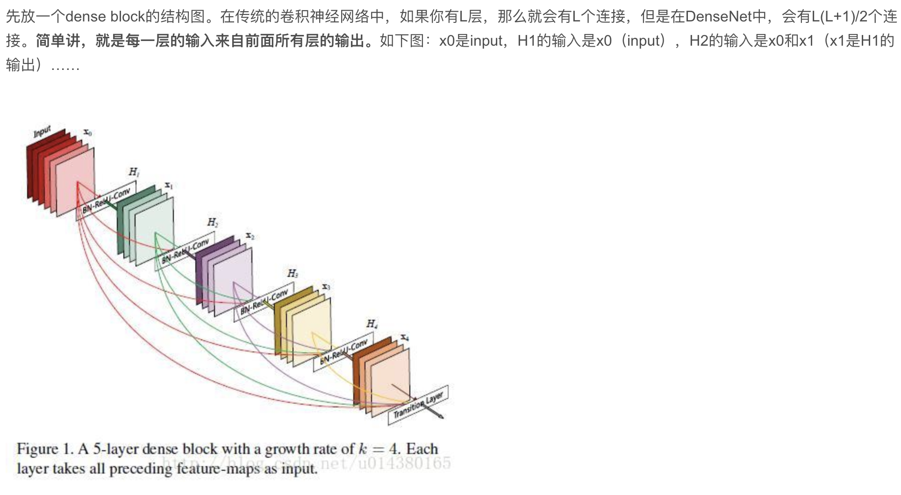
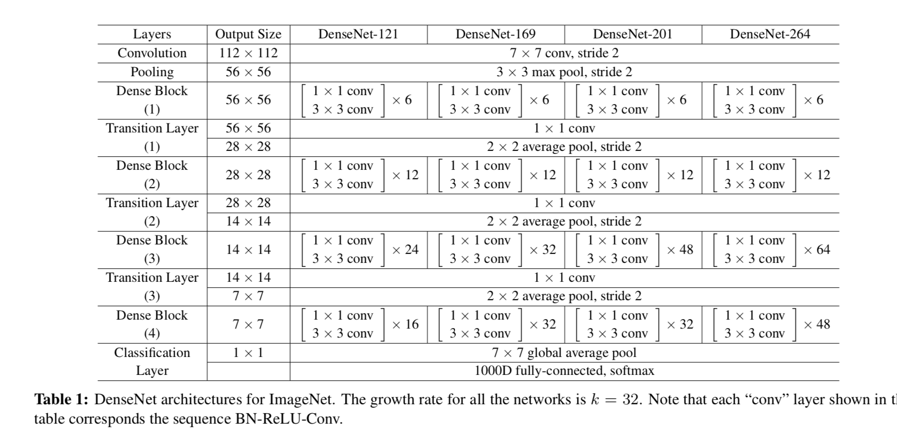

#

# 印象
- 这个有点像 NFM， AFM, 只不过是序列架构；

- 从代码里看真的是 concat
  def dense_block(self, input_x, nb_layers, layer_name):
        with tf.name_scope(layer_name):
            layers_concat = list()
            layers_concat.append(input_x)
 
            x = self.bottleneck_layer(input_x, scope=layer_name + '_bottleN_' + str(0))
 
            layers_concat.append(x)
 
            for i in range(nb_layers - 1):
                x = Concatenation(layers_concat)
                x = self.bottleneck_layer(x, scope=layer_name + '_bottleN_' + str(i + 1))
                layers_concat.append(x)
 
            x = Concatenation(layers_concat)
 
            return x
