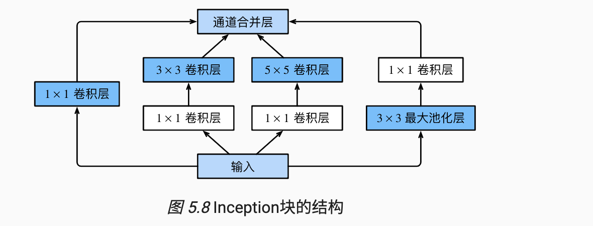
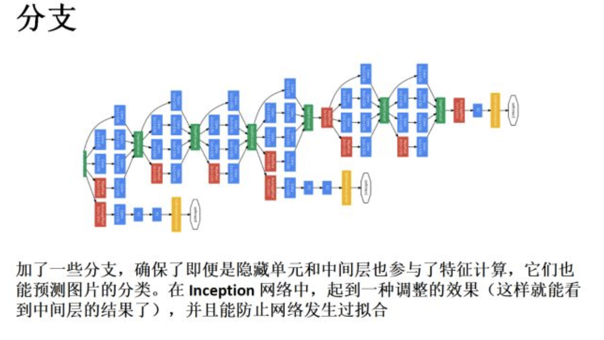

# Going Deeper with Convolutions

By a carefully crafted design, we increased the depth and width of the network while keeping the compu- tational budget constant.

## 印象
- 22 layers  
- Inception from the Network in network ：
    - Network-in-Network in order to increase the representational power of neural networks. 
    - In their model, additional 1 × 1 conv layers are added to the network, increasing its depth.
    - 1 × 1 convolutions have dual purpose: 
        - most critically, they are used mainly as dimension reduction modules to remove computational bottlenecks, 
        - that would otherwise limit the size of our networks. 
    - 即 公式 H_new = (H_old+Padding-filter_size)/stride + 1; 1*1卷积只改变通道数目，不改变H,W
    - 这里再强调一下 NIN 的意义：
        - 1*1 卷积是为了取代Alex_net最后三层全联接层的，因为这些做CV的讨厌全联接层，比如DropOut 是Alex 发明出来对付Dense layer的；
        - 1* 1 用一个参数（Channel_in 个），取代全联接F1*F2个参数，降低复杂度， 改变通道数；
        - 这里上升到大方向上就是， vision 模型 越宽越好，越深越好，全联接限制了这一点；
    - 1* 1， 3* 3， 5*5 都可以使得 H，W 不变；
        - this decision was based more on convenience rather than necessity
        - 怎么做到？
            - 只需要 filter 中线点 切合到 feat_map 左上角开始 stride=1;
            - 你自己做实验 拿个 3 *3 去滑动一个 4 *4 的图;
        - 为什么都是奇数？
            - 一是padding的原因，如果f是奇数，就可以从图像的两边对称的padding。
            - 第二点是奇数的f 有central pixel 可以方便的确定position.
    - 提出，总体来说，vision 模型 越宽越好，越深越好。
        - 但是drawbacks: 计算复杂+过拟合风险；
        - sol: A fundamental way of solving both of these issues would be to introduce sparsity and replace the fully connected layers by the sparse ones, even inside the convolutions
    - 希望高层 3 *3， 5 *5 的卷积核少一些，合理，要不然卷积核的感受野 还没堆几层就堆满了；
        - as features of higher abstraction are captured by higher layers, their spatial concentration is expected to decrease. This suggests that the ratio of 3×3 and 5×5 convolutions should increase as we move to higher layers.
- 模型结构图
- 四条并行通道，前三个不说了，都可以保证 H,W 不改变， 最后一个3*3 pooling, 一样的，也用padding same 的形式（只需要卷积核中心 卡住 feat_mat 左上角，开始 stride=1 开始滑动）
- 要有relu 激活（门机制），保证不是所有的信号都激活；
- 多个分支 
- 只在高层使用inception 
    -  it seemed beneficial to start us- ing Inception modules only at higher layers while keeping the lower layers in traditional convolutional fashion. This is not strictly necessary, simply reflecting some infrastructural inefficiencies in our current implementation.