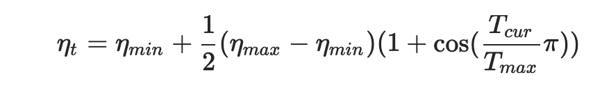
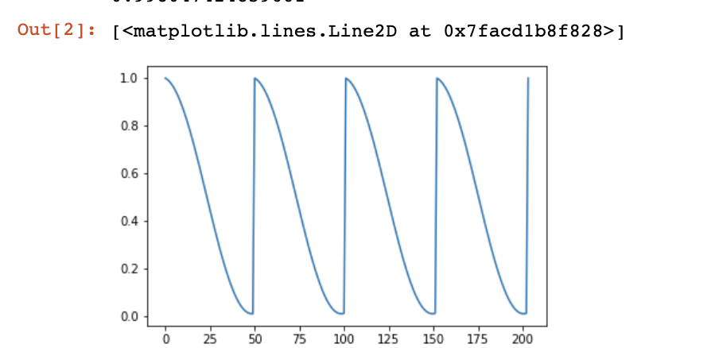

## lr_scheduler.CosineAnnealingLR(optimizer, T_max, eta_min=0, last_epoch=-1)

1. 公式及解释

	T_max (int) – Maximum number of iterations.
	eta_min (float) – Minimum learning rate. Default: 0.
	last_epoch (int) – The index of last epoch. Default: -1.

## 代码
	from torchvision import models
	import torch
	import matplotlib.pyplot as plt
	%matplotlib inline

	EPOCH=200
	snapshot = 4
	scheduler_step = EPOCH//snapshot
	model = models.AlexNet(num_classes=2)
	optimizer = torch.optim.SGD(params = model.parameters(), lr=1)
	scheduler = torch.optim.lr_scheduler.CosineAnnealingLR(optimizer, T_max=scheduler_step, eta_min=0.01) # min 为0.01;

	plt.figure()
	y = []
	for epoch in range(EPOCH):
	    scheduler.step()
	    y.append(scheduler.get_lr()[0])
	    if (epoch + 1) % scheduler_step == 0:
	        optimizer = torch.optim.SGD(params = model.parameters(), lr=1)
	        scheduler = torch.optim.lr_scheduler.CosineAnnealingLR(optimizer, T_max=scheduler_step, eta_min=0.01) # min 为0;
	        scheduler.step() # 会更改lr
	        print(scheduler.get_lr()[0])
	        y.append(scheduler.get_lr()[0])
	x = list(range(len(y)))
	plt.plot(x,y)

3. 结果

