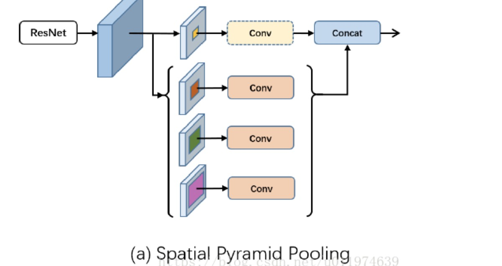
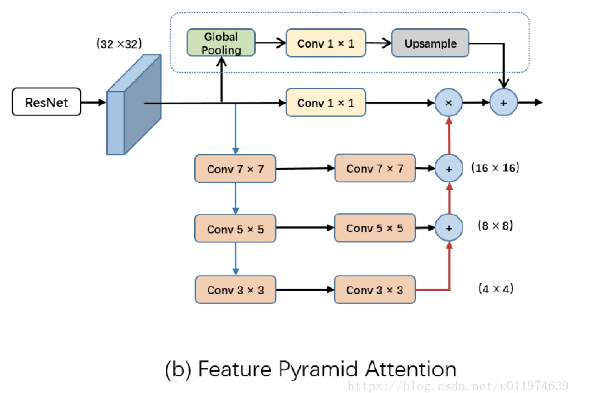
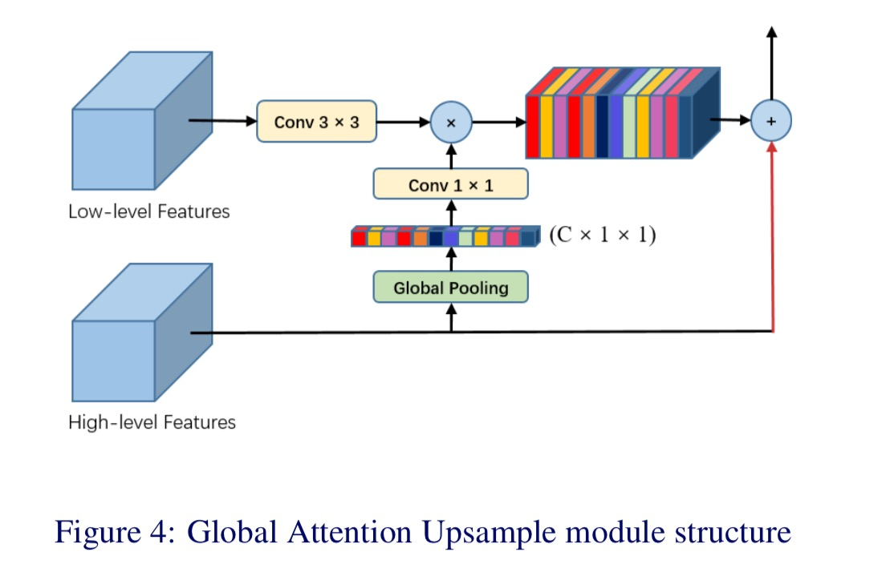
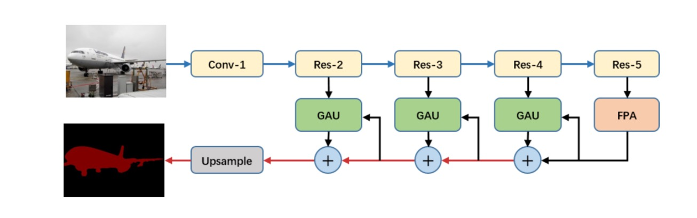

## Pyramid attention network for semantic segmentation.

## 印象、
    - 两张图加代码
    - 图1是之前 spatial pyramid pooling, 图2是本文对此的优化；
    - 具体看图2配合代码； 
    - 本文尝试解决两个问题：
        1. 多尺度问题/分辨率/H,W 尽管大小不同，但都可以是同一个object的图片描述；尺度不统一 就没法 跑标准的 resnet; 因为最后一层全联接要给定一致的input dim;
        2. 高层特征 更偏向语义信息， 底层特征 更偏向spatial 信息； 基于这个原因，语义分割模型，希望二者兼顾 fusing them together. 
    - 本文开发了两个模块： Pyramid Attention module & Global Attention Upsample
        - 前者如代码，或者图2
        - Recent models, such as PSPNet[35] or DeepLab[2], performed spatial pyramid pooling at several grid scales or apply ASPP module. Dilated convolution may result in local information missing and ‘grids’ which could be harmful for the local consistency of feature maps. Pyramid pooling module proposed in PSPNet loses pixel localization during different scale pooling operations.
        pooling 不利于 pixel localization;
        
        - Recent research has shown that combining CNNs with well-designed pyramid module can obtain considerable performance and capability to obtain category information. We consider that the main character of decoder module is to repair category pixel localization. Furthermore, high-level features with abundant category information can be used to weight low-level information to select precise resolution details.
        高层语义信息 作attention score 来帮助底层 localization 定位；
    - 图1 ASPP
    - 图2 Pyramid Attention module
    - 图3 Global Attention Upsample;   attention 体现在 channel 维度，SE异曲同工；
    - 图4 net architecture
    
    - 本文的缺陷： Global Attention Upsample attention 在channel 维度， 即channel SE, 可是实际上作者想做的是spacial SE. 完全可以做；

    

## 代码

    import torch
    import torch.nn as nn
    import torch.nn.functional as F
    import torchvision
    import ipdb

    class PyramidAttention(nn.Module):
        def __init__(self, input_dim, output_dim):
            super(PyramidAttention, self).__init__()
            self.glob = nn.Sequential(nn.AdaptiveAvgPool2d(1),
            nn.Conv2d(input_dim, output_dim, kernel_size=1, bias=False))

            self.down2_1 = nn.Sequential(nn.Conv2d(input_dim, input_dim, kernel_size=5, stride=2, padding=2, bias=False),
            nn.BatchNorm2d(input_dim),
            nn.ELU(True))
            self.down2_2 = nn.Sequential(nn.Conv2d(input_dim, output_dim, kernel_size=5, padding=2, bias=False),
            nn.BatchNorm2d(output_dim),
            nn.ELU(True))

            self.down3_1 = nn.Sequential(nn.Conv2d(input_dim, input_dim, kernel_size=3, stride=2, padding=1, bias=False),
            nn.BatchNorm2d(input_dim),
            nn.ELU(True))
            self.down3_2 = nn.Sequential(nn.Conv2d(input_dim, output_dim, kernel_size=3, padding=1, bias=False),
            nn.BatchNorm2d(output_dim),
            nn.ELU(True))

            self.conv1 = nn.Sequential(nn.Conv2d(input_dim, output_dim, kernel_size=1, bias=False),
            nn.BatchNorm2d(output_dim),
            nn.ELU(True))

        def forward(self, x):
            # x shape: 512, 16, 16
            x_glob = self.glob(x)  # 256, 1, 1
            x_glob = F.upsample(x_glob, scale_factor=16, mode='bilinear', align_corners=True)  # 256, 16, 16

            d2 = self.down2_1(x)  # 512, 8, 8
            d3 = self.down3_1(d2)  # 512, 4, 4

            d2 = self.down2_2(d2)  # 256, 8, 8
            d3 = self.down3_2(d3)  # 256, 4, 4

            d3 = F.upsample(d3, scale_factor=2, mode='bilinear', align_corners=True)  # 256, 8, 8
            d2 = d2 + d3

            d2 = F.upsample(d2, scale_factor=2, mode='bilinear', align_corners=True)  # 256, 16, 16
            x = self.conv1(x)  # 256, 16, 16
            x = x * d2

            x = x + x_glob

            return x
