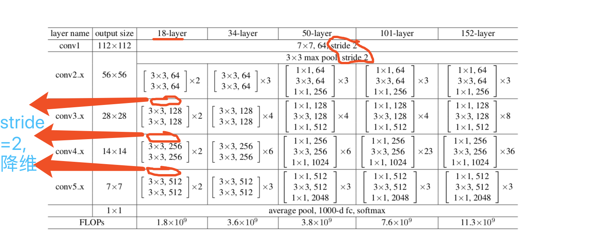

## Deep Residual Learning for Image Recognition

## 印象：
- 越深真的越好
- problem of vanishing/exploding gradients
- easier to optimize the residual mapping than to optimize the original, unreferenced mapping
- 有一些方法可以弥补，如归一初始化，各层输入归一化，使得可以收敛的网络的深度提升为原来的十倍。然而，虽然收敛了，但网络却开始退化了，
- 好处：
    - Shortcut Connections. 结构不增加任何参数
    - 优化残差更容易（导数为1+dF(x)）
- 代码理解 假设图片 3*300*300，
- 第一行 经过3*3卷积，stride=1, padding=1, 做了H，W 不变的same 卷积;
    - 【3，300，300】-> 【16, 300, 300】
- 你已经知道如何才能 same 卷积， （奇数卷积核 + padding(使得卷积核的中心卡住图片左上角开始卷积) + stride=1)
- 这里做 half 卷积， 正好降维一半， 只需要 padding=(filter_size - 1) // 2， stride=2, 
- 哦，**这样， padding=(filter_size - 1) // 2 才能 使得卷积核的中心卡住图片左上角**

        conv = self.conv_bn_layer(
        input=input,
        num_filters=64,
        filter_size=7,
        stride=2,
        act='relu',
        name="conv1")
        
- 代码不是看着费劲吗？看这里就好看了；
    
        depth = [2, 2, 2, 2]
        for block in range(len(depth)):
            for i in range(depth[block]):
                conv_name = "res" + str(block + 2) + chr(97 + i)
                conv = self.basic_block(
                    input=conv,
                    num_filters=num_filters[block],
                    stride=2 if i == 0 and block != 0 else 1,
                    is_first=block == i == 0,
                    name=conv_name)