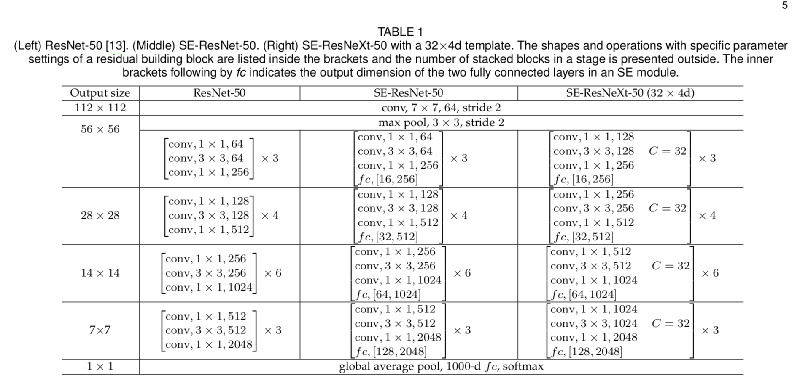
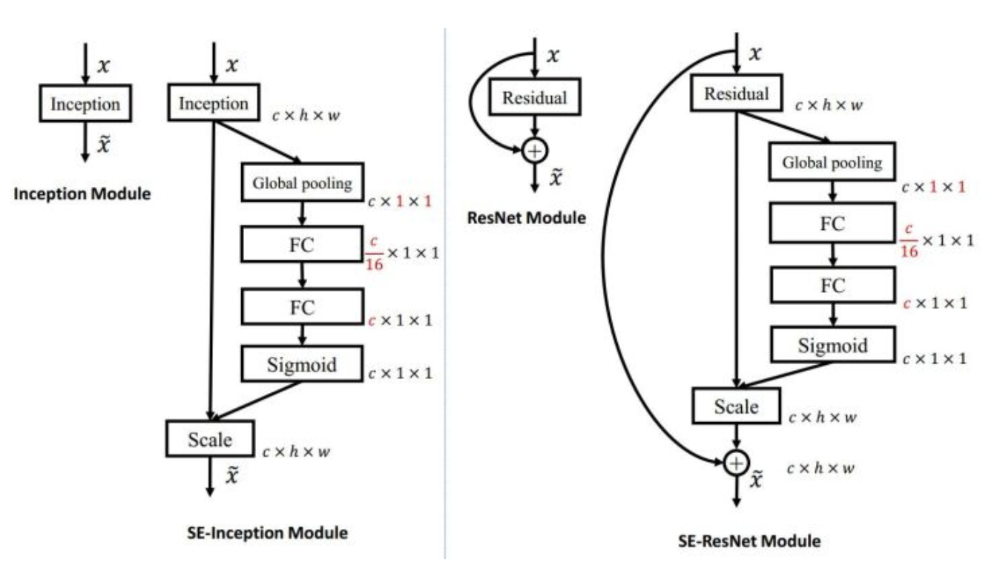

## Squeeze-and-Excitation Networks

- 强调了 通道 重要性
- 证明了 resnet + inception 是比单独更强啊
- Channel 门机制 
- 代码模型参数 
- 
- 细节
    - 1。 通道级别 att_score 必须要接全联接层，如果没有参数，那么就无法反向传播，无法自动学习通道级别门信号
        - 两层全联接比一层全联接好，可以limit model complexity, optimal 1/16
        - 比如 【1，10】@【10，10】= 【1，10】 参数量是100
        - 比如 【1，10】@【10，3】@【3，10】= [1, 10] 参数量是60
    
    - 2。 这个门机制 可以和 resnet , inception 结合；
    
    
    - 3。代码里展示了 SE-ResNeXt 结构；
        - 这个结构用了 resNeXt 结构， 实际上是resNet + Inception；但是是以更简洁的分组卷积形式做到的；
        - 多了个超参数 cardinality 或者说 Groups, 表示 单个Inception 结构用多少个分支；
        - 比如 [64, 300, 300],out_channel = 128; 
            - 如果Group =32 代表每组只能看到2个channel的数据；
            - 同时输出，每组通道只输出4个channel, 合起来是128个channel;
        