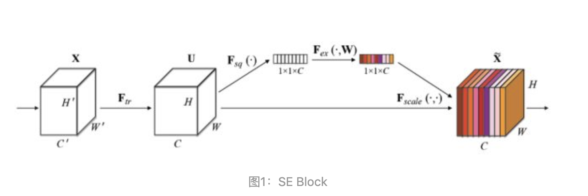

## Squeeze-and-Excitation Networks

- 强调了 通道 重要性
- 证明了 resnet + inception 是比单独更强啊
- Channel 门机制 
- 
- 细节
    - 1。 通道级别 att_score 必须要接全联接层，如果没有参数，那么就无法反向传播，无法自动学习通道级别门信号
        - 两层全联接比一层全联接好，可以limit model complexity
        - 比如 【1，10】@【10，10】= 【1，10】 参数量是100
        - 比如 【1，10】@【10，3】@【3，10】= [1, 10] 参数量是60
    - 2。 这个门机制 可以和 resnet , inception 结合；